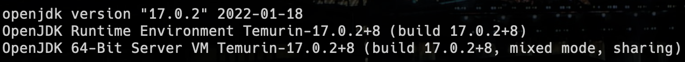

# Object Oriented Programming and Development with Java

This repository contains all the Java programs that I have executed for my Object Oriented Programming and Development with Java Course in my 2nd Year of Computer Science Undergrad program at Dayananda Sagar University, Bengaluru, India in Q1 2022.

## List of Programs

| Serial No. | C File Name | Description |
| :---: | :--- | :--- |
| 1  | [1_electricityBill.java](https://github.com/rexgraystone/oodj/blob/master/1_electricityBill.java) | This program calculates the electricity bill for a given number of units. |
| 2  | [2_Zeros.java](https://github.com/rexgraystone/oodj/blob/master/2_Zeroes.java) | This program moves all the zeros to the end of an array. |
| 3  | [3_NonRepeatingBoolean.java](https://github.com/rexgraystone/oodj/blob/master/3_NonRepeatingBoolean.java) | This program finds the first non-repeating character in an array. |
| 4  | [4_Inheritance.java](https://github.com/rexgraystone/oodj/blob/master/4_Inheritance.java) | This program demonstrates the concept of inheritance in Java. |
| 5  | [5_MethodOverload.java](https://github.com/rexgraystone/oodj/blob/master/5_MethodOverload.java) | This program demonstrates the concept of method overloading in Java. |
| 6  | [6_GarbageCollect.java](https://github.com/rexgraystone/oodj/blob/master/6_GarbageCollect.java) | This program demonstrates the concept of garbage collection in Java. |
| 7  | [7_Polymorphism.java](https://github.com/rexgraystone/oodj/blob/master/7_Polymorphism.java) | This program demonstrates the concept of polymorphism in Java. |
| 8  | [8_ExceptionHandling.java](https://github.com/rexgraystone/oodj/blob/master/8_ExceptionHandling.java) | This program demonstrates the concept of exception handling in Java. |
| 9  | [9_MultiThreadExample.java](https://github.com/rexgraystone/oodj/blob/master/9_MultiThreadExample.java) | This program demonstrates the concept of multi-threading in Java. |
| 10  | [10_JTableP.java](https://github.com/rexgraystone/oodj/blob/master/10_JTableP.java) | This program implements a JTable in Java. |
| 11  | [11_JFUI.java](https://github.com/rexgraystone/oodj/blob/master/11_JFUI.java) | This program implements a JFrame in Java. |
| 12  | [12_Database.java](https://github.com/rexgraystone/oodj/blob/master/12_Database.java) | This program implements a database and database operations in Java. |

## How to Run

1. Ensure that you have Java installed on your system.

    ```bash
    java -version
    ```

    It should look something like this 

    If you don't have Java installed, you can download it from [here](https://www.oracle.com/in/java/technologies/javase-downloads.html).

    - To install Java on Ubuntu, you can follow this [tutorial](https://www.digitalocean.com/community/tutorials/how-to-install-java-with-apt-on-ubuntu-20-04).

    - To install Java on macOS, you can follow this [tutorial](https://www3.ntu.edu.sg/home/ehchua/programming/howto/JDK_Howto.html).

    - To install Java on Windows, you can follow this [tutorial](https://www3.ntu.edu.sg/home/ehchua/programming/howto/JDK_Howto.html).

2. Clone the repository to your local machine using the following command.

    ```bash
    gh repo clone rexgraystone/oodj
    ```

    or

    ```bash
    git clone https://github.com/rexgraystone/oodj.git
    ```

3. Navigate to the directory where you cloned the repository.

    ```bash
    cd oodj
    ```

4. Compile the Java program using the following command.

    ```bash
    javac <Serial Number>_<Java File Name>.java
    ```

    For example, to compile the first program, you can use the following command.

    ```bash
    javac 1_Electricity.java
    ```

    The serial number is the number in the first column of the table above.

5. Run the Java program using the following command.

    ```bash
    java <Java File Name>.class
    ```

    For example, to run the first program, you can use the following command.

    ```bash
    java 1_Electricity.class
    ```

### Note

The programs are written in Java and compiled using the JDK version 17.0.2. on macOS Monterey 12.0.1.
